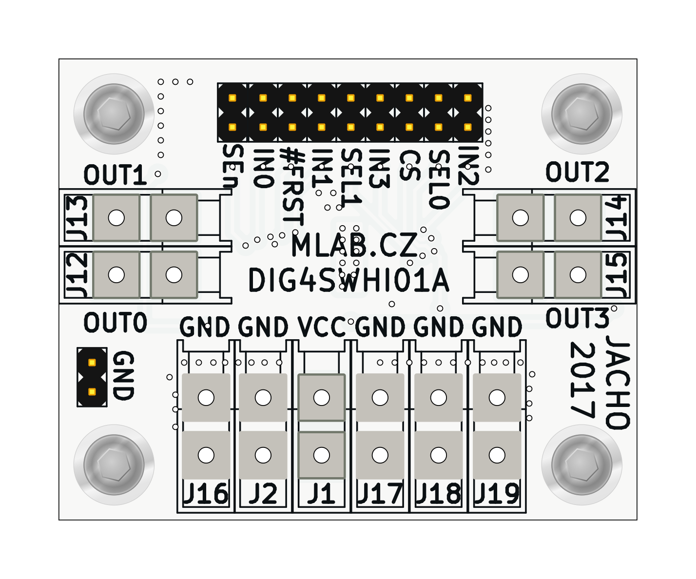
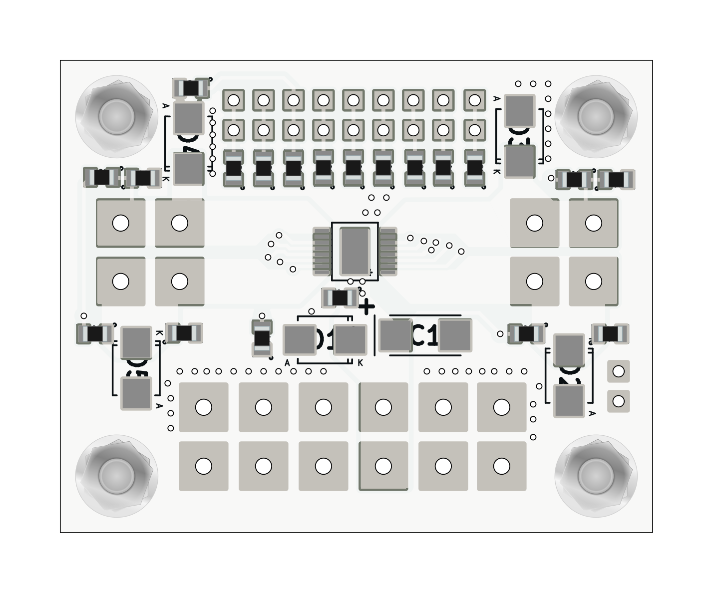

# DIG4SWHI01A - quad channel current sensing high-side switch

Switch for voltage from 4 V to 28 V. Resistance in spliced state 50 mOhm. Integrated circuit [VNQ7050AJ](https://www.st.com/en/automotive-analog-and-power/vnq7050aj.html).

